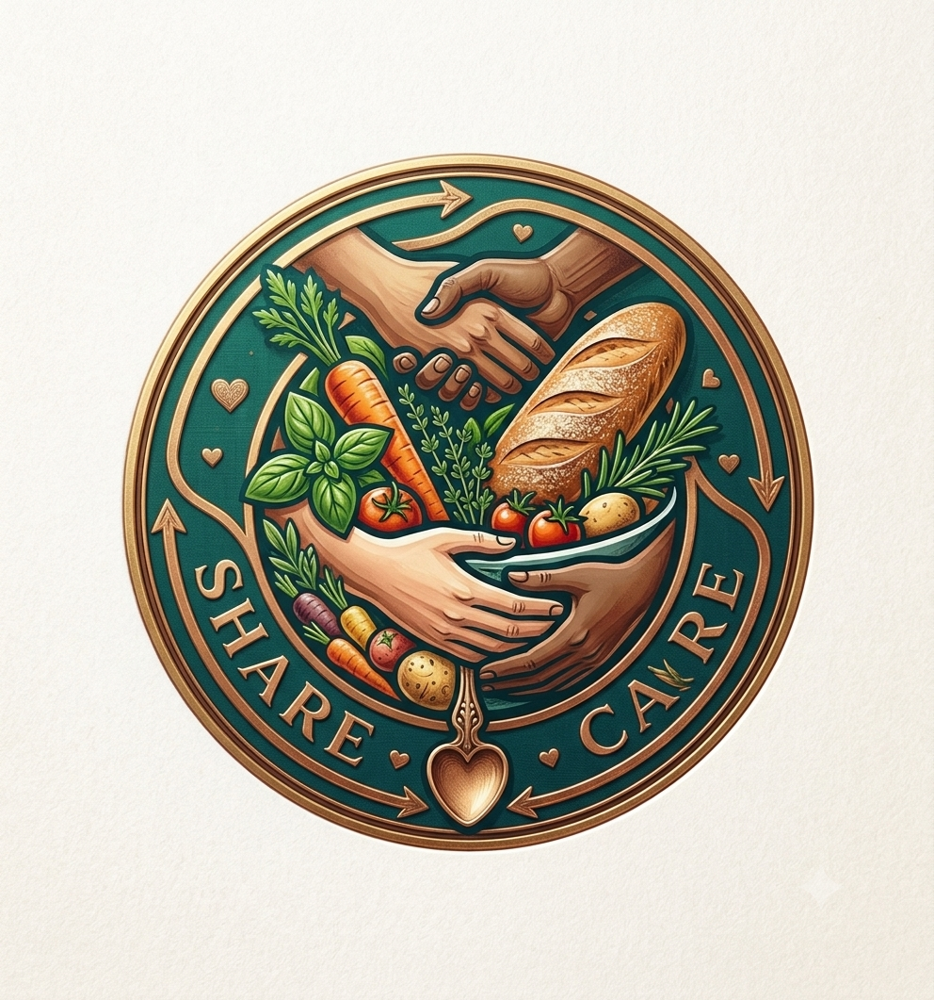

<div align="center">



# 🍱 Feedforward

### Community Surplus Food-Sharing Platform

**Feedforward** is a full-stack community food-sharing web application that connects people who have safe surplus food with nearby people who can use it. Users can publish available food, explore shared meals, submit requests, manage their own listings, and coordinate pickup through a respectful approval system.

<br />

[](https://feedforward-frontend-silk.vercel.app)
[](https://github.com/kouser-ahamed/feedforward-frontend)
[](https://github.com/kouser-ahamed/feedforward-backend)

</div>

---

## 📋 Table of Contents

- [Project Overview](#-project-overview)
- [Purpose of the Project](#-purpose-of-the-project)
- [Live Links](#-live-links)
- [Demo User Credentials](#-demo-user-credentials)
- [Key Features](#-key-features)
- [How Feedforward Works](#-how-feedforward-works)
- [Food Request Lifecycle](#-food-request-lifecycle)
- [Page Structure](#-page-structure)
- [Authentication and Security](#-authentication-and-security)
- [Technology Stack](#-technology-stack)
- [NPM Packages](#-npm-packages)
- [Environment Variables](#-environment-variables)
- [Installation and Setup](#-installation-and-setup)
- [Project Routes](#-project-routes)
- [API Overview](#-api-overview)
- [Project Structure](#-project-structure)
- [Screenshots](#-screenshots)
- [Developer](#-developer)
- [Project Information](#-project-information)

---

## 📌 Project Overview

Feedforward is a modern food-sharing platform built to reduce avoidable food waste and encourage responsible community support. A user who has safe, fresh, and surplus food can publish a food post with important information such as category, preparation date, expiry date, pickup location, halal status, description, and an image.

Other users can explore available food, open a detailed food page, and submit a request explaining why and when the food is needed. The food owner can then review all incoming requests, approve one requester, reject requests, provide pickup instructions, and manage the complete sharing process.

The application is built with **Next.js**, **TypeScript**, **Tailwind CSS**, **HeroUI**, **Better Auth**, **Express.js**, **MongoDB**, and **JWT verification using JOSE**. It includes a responsive user interface, Google authentication, protected pages, request-status management, server-side API operations, and production deployment on Vercel.

---

## 🎯 Purpose of the Project

The main goals of Feedforward are to:

- Reduce the amount of safe surplus food that is unnecessarily wasted
- Connect food owners with people in the same community
- Make food sharing respectful, transparent, and easy to manage
- Allow users to coordinate food pickup safely
- Encourage community care without presenting food sharing as charity
- Provide a practical digital platform for homes, events, restaurants, and community programmes

---

## 🌐 Live Links

| Item | Link |
|------|------|
| 🌐 Live Website | https://feedforward-frontend-silk.vercel.app |
| 📁 Frontend Repository | https://github.com/kouser-ahamed/feedforward-frontend |
| 🖥️ Backend Repository | https://github.com/kouser-ahamed/feedforward-backend |

---

## 🔐 Demo User Credentials

### Demo User 1

```text
Email    : towfiq@gmail.com
Password : dsfS12323
```

### Demo User 2

```text
Email    : opuislam@gmail.com
Password : Opu123456
```

> These accounts are provided only for project demonstration. Keep only test data in public demo accounts and never reuse these passwords for personal accounts.

---

## ✨ Key Features

### 🌍 Public Features

- Professional and responsive landing page
- Interactive hero slider with automatic slide transitions
- Previous, next, and slide-indicator controls
- Animated hero content and CTA buttons
- Latest shared food section
- Expiring-soon food section for urgent pickup
- Community impact statistics
- “How It Works” process section
- Volunteer and community-focused sections
- Frequently asked questions section
- Browse all currently available food
- Food search, sorting, filtering, and pagination
- Food details page with complete information
- Related food recommendations
- Responsive navbar and mobile navigation
- Fully functional footer with quick links, contact information, and social profiles
- Smooth scroll-to-top functionality
- Dark and light mode friendly interface
- Custom loading states and fallback UI
- Responsive design for mobile, tablet, laptop, and desktop

### 🔑 Authentication Features

- Email and password registration
- Email and password login
- Google OAuth login
- Better Auth session management
- Secure JWT token generation
- Protected route handling
- Callback URL support after login
- Persistent authentication after page refresh
- Password validation with:
  - Minimum 8 characters
  - At least one uppercase letter
  - At least one lowercase letter
- Logout functionality
- Demo credential auto-fill support

### 🍲 Food Sharing Features

- Authenticated users can create a food post
- Add food name, image, category, quantity, description, and location
- Add preparation and expiry dates
- Specify whether the food is halal
- Food status is stored as `available` when published
- View personal food listings
- Update existing shared food information
- Delete personal food posts
- Prevent unavailable or booked food from appearing in available-food sections
- Display only currently available food on public listing pages

### 📩 Food Request Features

- Logged-in users can request available food
- Request form includes:
  - Requester information
  - Phone number
  - Address
  - Request description
  - Date when the food is needed
- Duplicate or invalid requests are prevented by backend validation
- Requesters can view all of their submitted requests
- Request status is displayed as:
  - `pending`
  - `approved`
  - `rejected`
- Requesters can see owner pickup details after approval
- Users can delete eligible requests from their request history

### 📥 Incoming Request Management

- Food owners can view requests received for their food posts
- Requests are grouped by food item
- View all requesters in a detailed table
- Approve one pending request
- Reject a pending request with a reason
- Add pickup location, contact number, and owner message during approval
- Approval changes the food status from `available` to `booked`
- Approval automatically rejects the remaining pending requests for the same food
- Delete a single incoming request
- Delete all requests connected to one food
- Real-time request counts for total, pending, approved, and rejected requests

### 🛡️ Validation and Safety

- Frontend and backend validation for important fields
- Only the food owner can manage incoming requests
- Only the requester can manage their own requests
- Protected API routes require a valid JWT
- Invalid MongoDB document IDs are handled safely
- Complete pickup information is required before approval
- Food-request decisions are validated on the backend
- Sensitive configuration is stored in environment variables
- CORS is configured for the approved frontend domain

---

## ⚙️ How Feedforward Works

### Food Owner Flow

```text
Create an Account or Log In
          ↓
Open the Share Food Page
          ↓
Publish Safe Surplus Food
          ↓
Food Appears in Available Foods
          ↓
Receive Requests from Community Members
          ↓
Review Requester Information
          ↓
Approve One Request or Reject Requests
          ↓
Provide Pickup Location and Contact Details
          ↓
Food Status Changes to Booked
```

### Food Requester Flow

```text
Browse Available Foods
          ↓
Open Food Details
          ↓
Submit a Food Request
          ↓
Track the Request from My Requests
          ↓
Owner Reviews the Request
          ↓
Approved → Receive Pickup Information
Rejected → View Request Status
```

---

## 🔄 Food Request Lifecycle

```text
Food Published
Status: available
        ↓
Requester Submits Request
Request Status: pending
        ↓
Owner Reviews Incoming Requests
        ↓
 ┌───────────────────────┬───────────────────────┐
 │                       │                       │
Approve Request      Reject Request       Delete Request
 │                       │                       │
Request: approved    Request: rejected    Request removed
Food: booked         Food: available      Food unchanged
 │
Other pending requests for the same food
are automatically changed to rejected
```

---

## 🗂️ Page Structure

### Public Pages

| Page | URL | Description |
|------|-----|-------------|
| Home | `/` | Hero slider, latest food, expiring food, process, impact, FAQ, and other sections |
| All Foods | `/all-foods` | Browse available food with search, sorting, and pagination |
| Food Details | `/all-foods/[id]` | Full food information and related food |
| About Us | `/about-us` | Mission, values, and information about Feedforward |
| Contact | `/contact` | Contact form and platform contact information |
| Support | `/support` | Help and support information |
| Privacy Policy | `/privacy-policy` | Privacy and data-use policy |
| Login | `/login` | Email/password and Google login |
| Sign Up | `/signup` | User registration form |

### Protected Pages

| Page | URL | Description |
|------|-----|-------------|
| Share Food | `/share-food` | Create a new food-sharing post |
| My Shared Foods | `/my-shared-foods` | View and manage food shared by the logged-in user |
| Request Food | `/request-send/[id]` | Submit a request for a selected food |
| My Requests | `/my-requests` | Track food requests submitted by the user |
| Incoming Requests | `/incoming-food-requests` | Manage requests received for the user’s food posts |

---

## 🔑 Authentication and Security

Feedforward uses **Better Auth** for user authentication and **JWT-based backend authorization**.

### Login Methods

- Email and password
- Google OAuth

### Authentication Flow

```text
User Logs In
     ↓
Better Auth Creates a Secure Session
     ↓
Frontend Requests a JWT Token
     ↓
Token Is Sent in the Authorization Header
     ↓
Express Backend Verifies the Token with JOSE
     ↓
Protected Food or Request Operation Is Allowed
```

### Protected Request Example

```http
Authorization: Bearer <jwt_token>
```

### Security Features

- Authentication state is preserved after refresh
- Protected pages redirect unauthenticated users to login
- Callback URLs return users to their intended page
- Backend authorization is not dependent only on frontend checks
- Food ownership and request ownership are verified on protected operations
- MongoDB credentials, Google OAuth secrets, and authentication secrets remain in environment variables
- Public repositories do not contain private production keys

---

## 🛠️ Technology Stack

### Frontend

| Technology | Purpose |
|------------|---------|
| Next.js 16 | React framework, App Router, routing, server rendering, and optimization |
| React 19 | Component-based user interface |
| TypeScript | Static typing and safer development |
| Tailwind CSS 4 | Utility-first responsive styling |
| HeroUI | Accessible and reusable UI components |
| Better Auth | Authentication and session management |
| React Icons | Icon library |
| Next Image | Optimized responsive images |
| Vercel | Frontend deployment |

### Backend

| Technology | Purpose |
|------------|---------|
| Node.js | Backend JavaScript runtime |
| Express.js 5 | REST API framework |
| TypeScript | Typed backend development |
| MongoDB | Food, request, and user data storage |
| MongoDB Atlas | Cloud database hosting |
| JOSE | JWT verification |
| CORS | Cross-origin request management |
| dotenv | Environment variable management |
| Vercel | Serverless backend deployment |

---

## 📦 NPM Packages

### Frontend Core Packages

```text
next
react
react-dom
typescript
tailwindcss
@heroui/react
better-auth
react-icons
```

### Backend Dependencies

```text
express
mongodb
cors
dotenv
jose-cjs
```

### Backend Development Dependencies

```text
typescript
tsx
@types/node
@types/express
@types/cors
```

---

## 🔒 Environment Variables

### Frontend

Create a `.env.local` file in the frontend project root:

```env
NEXT_PUBLIC_SERVER_URL=http://localhost:5000

BETTER_AUTH_URL=http://localhost:3000
BETTER_AUTH_SECRET=your_long_random_auth_secret

GOOGLE_CLIENT_ID=your_google_oauth_client_id
GOOGLE_CLIENT_SECRET=your_google_oauth_client_secret

MONGODB_URI=your_mongodb_connection_string
MONGODB_DB_NAME=your_database_name
```

For production:

```env
NEXT_PUBLIC_SERVER_URL=https://feedforward-backend.vercel.app
BETTER_AUTH_URL=https://feedforward-frontend-silk.vercel.app
```

### Backend

Create a `.env` file in the backend project root:

```env
PORT=5000
NODE_ENV=development

MONGODB_URI=your_mongodb_connection_string
MONGODB_DB_NAME=your_database_name

CLIENT_URL=http://localhost:3000
BETTER_AUTH_URL=http://localhost:3000
```

For production:

```env
NODE_ENV=production
CLIENT_URL=https://feedforward-frontend-silk.vercel.app
BETTER_AUTH_URL=https://feedforward-frontend-silk.vercel.app
```

> Never commit `.env`, `.env.local`, MongoDB connection strings, OAuth secrets, JWT secrets, or production credentials to GitHub.

---

## 💻 Installation and Setup

### Prerequisites

- Node.js 18 or newer
- npm
- MongoDB Atlas account or local MongoDB
- Google Cloud OAuth credentials
- Git

### 1. Clone the Frontend Repository

```bash
git clone https://github.com/towfiq-dev/feedforward-frontend.git
cd feedforward-frontend
```

### 2. Install Frontend Dependencies

```bash
npm install
```

### 3. Configure Frontend Environment Variables

Create `.env.local` and add the required frontend variables.

### 4. Run the Frontend

```bash
npm run dev
```

The frontend will run at:

```text
http://localhost:3000
```

### 5. Clone the Backend Repository

Open another terminal:

```bash
git clone https://github.com/towfiq-dev/feedforward-backend.git
cd feedforward-backend
```

### 6. Install Backend Dependencies

```bash
npm install
```

### 7. Configure Backend Environment Variables

Create `.env` and add MongoDB, frontend URL, and authentication configuration.

### 8. Run the Backend

```bash
npm run dev
```

The backend will run at:

```text
http://localhost:5000
```

### Production Build

Frontend:

```bash
npm run build
npm run start
```

Backend:

```bash
npm run build
npm run start
```

---

## 🗺️ Project Routes

### Public Routes

```text
/
/about-us
/all-foods
/all-foods/[id]
/contact
/login
/privacy-policy
/signup
/support
```

### Protected Routes

```text
/share-food
/my-shared-foods
/my-requests
/incoming-food-requests
/request-send/[id]
```

### Authentication API Route

```text
/api/auth/[...all]
```

---

## 🔌 API Overview

### Foods

- Create a food post
- Get all available foods
- Search, sort, filter, and paginate foods
- Get latest available foods
- Get foods that are expiring soon
- Get one food by ID
- Get related foods
- Get food posts created by the logged-in user
- Update an owned food post
- Delete an owned food post
- Change food status after request approval

### Food Requests

- Submit a food request
- Get requests submitted by the logged-in user
- Get incoming requests for food owned by the logged-in user
- Get request counts by status
- Approve a food request
- Reject a food request with a reason
- Automatically reject other pending requests after approval
- Delete a single request
- Delete all requests connected to one food

### Community Information

- Get community impact statistics
- Calculate shared-food and request-related totals

### Authentication and Authorization

- Create and manage Better Auth sessions
- Generate frontend JWT tokens
- Verify JWT tokens on protected backend routes
- Restrict protected operations to authenticated users
- Validate food ownership and requester ownership

---

## 📁 Project Structure

### Frontend

```text
feedforward-frontend/
├── public/
│   └── assets/
│       ├── logo11.png
│       └── feedforward/
│           ├── heroimg-1.png
│           ├── heroimg-2.png
│           ├── heroimg-3.png
│           └── ui/
│               ├── 1.png
│               ├── 2.png
│               └── ... 15.png
├── src/
│   ├── app/
│   │   ├── api/auth/[...all]/
│   │   ├── all-foods/
│   │   ├── incoming-food-requests/
│   │   ├── my-requests/
│   │   ├── my-shared-foods/
│   │   ├── request-send/[id]/
│   │   ├── share-food/
│   │   ├── login/
│   │   └── signup/
│   ├── components/
│   ├── lib/
│   └── types/
├── .env.local
├── package.json
└── README.md
```

### Backend

```text
feedforward-backend/
├── index.ts
├── .env
├── package.json
├── tsconfig.json
└── README.md
```

---

## 👨‍💻 Developer

**Towfiqul Islam**

Feedforward is a full-stack web development project demonstrating:

- Next.js App Router architecture
- TypeScript-based frontend and backend development
- RESTful API design
- MongoDB database integration
- Better Auth authentication
- Google OAuth
- JWT-based authorization
- Protected route management
- Food-post ownership validation
- Multi-step food-request workflows
- Responsive and accessible interface design
- Production deployment with Vercel

### Contact

```text
Email : towfiqulislam017399@gmail.com
Phone : 0174836304376
```

### Social Profiles

- Facebook: https://www.facebook.com/towfiqul618539
- GitHub: https://github.com/towfiq-dev
- LinkedIn: https://www.linkedin.com/in/towfiqulislam1

---

## 📝 Project Information

```text
Project Name     : Feedforward
Project Type     : Community Surplus Food-Sharing Platform
Frontend         : Next.js, TypeScript, Tailwind CSS, HeroUI
Backend          : Node.js, Express.js, TypeScript
Database         : MongoDB
Authentication   : Better Auth, Google OAuth, JWT
Live Website     : https://feed-forward-frontend-pi.vercel.app
Live Backend     : https://feedforward-backend.vercel.app
Frontend Repo    : https://github.com/towfiq-dev/FeedForward-frontend
Backend Repo     : https://github.com/towfiq-dev/feedforward-backend
Developer Email  : towfiqulislam017399@gmail.com
```

---

<div align="center">

### Share Food. Reduce Waste. Strengthen Community.

© 2026 Feedforward. All rights reserved.

</div>